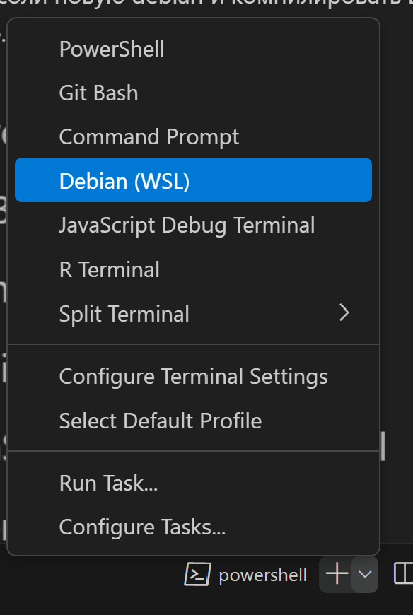

# Инструкция по настройке окружения

## windows

1. Устанавливаем wsl (по инструкции из первой ссылки гугла)
2. В powershell выполняем 

```bash
wsl --install Debian
```

3. Открываем установленный дебиан, там выполняем

```bash
echo 'deb https://deb.debian.org/debian/ unstable main contrib non-free
deb-src https://deb.debian.org/debian/ unstable main contrib non-free' | sudo tee -a /etc/apt/sources.list 
sudo apt upgrade
sudo apt update
```

Ура, ваша среда готова (гит и прочие g++ доставляем самостоятельно, я в вас верю)

Дальше можно в нашей любимой vscode выбрать в качестве консоли новую debian и компилировать все прямо из нее.




Для добавления своего файла в сборку необходимо добавить его в BuildConfig.json в параметр build_files